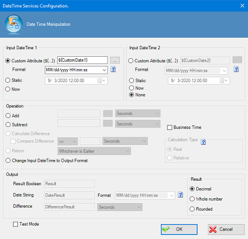

__[Home](/) --> [Reference](/ref) --> [Parent Shape](javascript:history.back()) --> DateTime Operations Configuration__

# DateTime Operations Configuration

This window enables you to configure date calculations.

| Property | Description |
| -------- | ----------- |
|**Input DateTime**	|Specifies 1 or 2 dates to use as input values. You can select a Custom Attribute, a Static date and time, or the date and time Now (when the DateTime AgilePart is initiated).|
|**Add**	|Specifies an amount of time to add to the Input DateTime.|
|**Subtract**	|Specifies an amount of time to subtract from the Input DateTime.|
|**Compare Difference**	|Indicates whether to compare the difference between the two Input DateTime values.|
|**Return**	|
Specifies whether to pass the earlier or later value based on the comparison. Change Input DateTime to Output Format. Indicates that the Input DateTime format will be converted to the Output.
|
|**Business Time**	|Specifies that the AgilePoint work calendar is taken into account for calculations.|
|**Calculation Type**	|Specifies whether to calculate or compare the difference between Input DateTime 1 and Input DateTime 2. You can specify the following types of calculations:<ul><li>**Real** - The actual difference between the two input DateTimes. The result depends on the setting for the Result option.</li><li>**Relative** - This setting is useful for situations such as when an action is allowed once per month. The "real" difference between the last day of one month and the first day of following month is 0 months. However, in "relative" mode, this difference is calculated as one month because the dates are in adjacent months. This returns the relative number of time units (days, weeks, months, years) between the two input DateTimes. For example, the Relative differences between Sat 29-Dec-2007 23:59:59 and Wed 02-Jan-2008 00:00:00 are 4 days or 1 week or 1 month or 1 year, depending upon the time unit specified.</li></ul>|
|**Result**	|Specifies the type of value to return for calculations where the Calculation Type is Real:<ul><li>**Decimal** - Returns the difference as is, including any decimals.</li><li>**Whole Number** - Returns the integer part of the result by removing the decimal part.</li><li>**Rounded** - Rounds up (>=0.5) or rounds down (<0.5) the result.</li></ul>|
|**Result Boolean**	|If Compare Difference is enabled, the difference will be evaluated as a Boolean (True/False) result, and the Boolean value will be associated with the text that appears in this field.|
|**Date String**	|If based on the operation performed, the output is of type DateTime, the result will be converted to a string and stored in the format provided in the Format list, and stored associated with the text that appears in this field.|
|**Difference**	|If Compare Difference is enabled, the difference will be stored as a NameValue where the name is the text that appears in this field, and the value is the output value.

## Disclaimer of warranty

[Disclaimer of warranty](../../guides/common/DisclaimerOfWarranty.md)