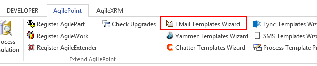
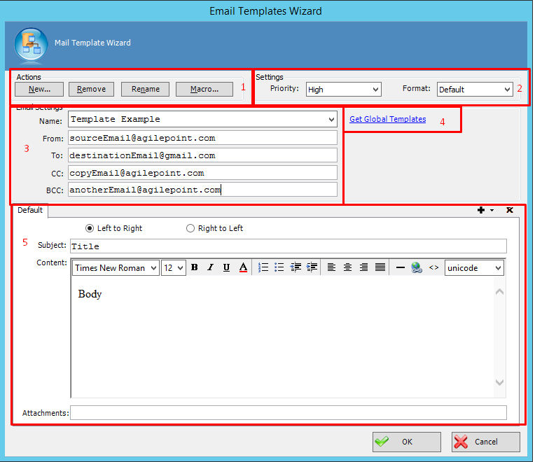
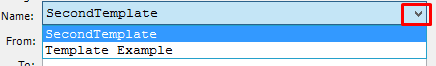
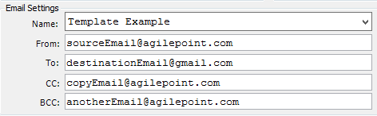
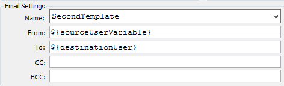
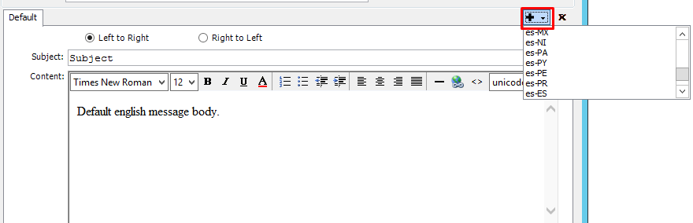
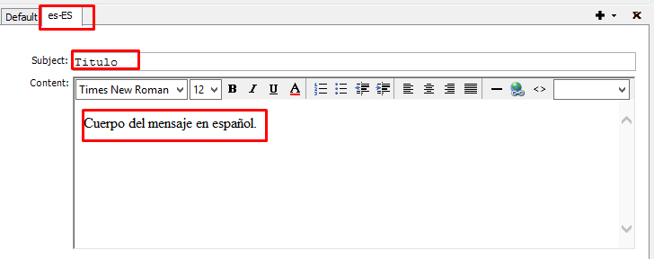
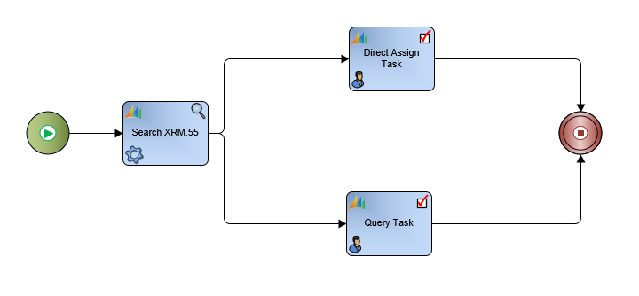
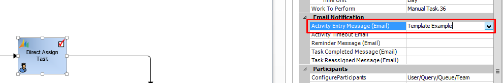
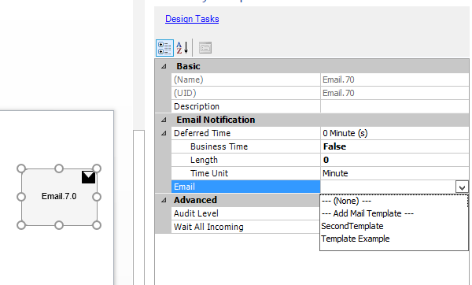

__[Home](/) --> [Reference](/ref) --> [Back](javascript:history.back()) --> AgilePoint Email Template__

# Defining an AgilePoint Email Template

There is a very useful functionality that allows us to define Email custom
templates that could be used by our processes templates in many situations.

To describe in depth those capabilities:

* Open a process template, click on “AgilePoint” ribbon, and choose “Email
Templates Wizard”.

The main menu comes up; the properties are to be detailed next:

1. Actions:

Buttons to Create templates, remove or rename existing templates, and create
custom macros

2. Settings:

It is possible for the created Emails to have a configured priority which will
be shown on runtime, and also to be shown in a certain format (Text or html).

3. Email Settings:

Name. Allowed to move between existing templates, by clicking on the dropdown.

Rest of Email properties of the template we are creating (Sender and receiver
email addresses, Carbon and Blind Carbon copy). 
Note: it is possible to fill
those properties with custom variables of the process template we are working
with. **Important. For using the template with certain shapes (AgileXRM Email
Activity), we also could give some details (from, to…) a CRM User instead of an
email address, as such shape allows to work with CRM directly.**

4. It is also possible to access to global templates defined in AgilePoint

Enterprise Manager, by clicking on this link. Once connected to AgilePoint
Server, a list of available global templates will be listed to select.

5. Details of the Email template body, like:

Localization settings for the template. Several languages could be configured
for the same Email Template, and the body message could be configured
accordingly, by clicking on the described buttons.

e.g. Given a template which we want to configure for two languages, we would
click on the ‘plus’ image (screen below):

After doing so, the new language-specific tab is up and ready to go, for
implementing the specific body details:

Lastly, removing language options for the template is done by positioning
ourselves into the desired language tab, and clicking on the ‘cross’ button,
just beside the ‘plus’ button.

Subject content. Specifies the email title and body. It can include custom
process variables and / or normal text, and the text direction could be
configured by choosing the default ‘left to right’ or ‘right to left’ (for
arabic languages) as well. The body style could be adapted using the editor
properties (bold, italic style for fonts, different font size, hyperlinks and
many more features).

Once the Email Template is configured, click ‘OK’ and it will be ready to be
used on our template. AgileXRM shapes have some properties belonging to “Email
Notification” category, which can be attached to an Email Template.

e.g. Given this process template diagram:

We want to send an Email using the template we have created, when the process
instance reaches the activity called “Direct Assign Task”. For such task, this
activity should be clicked, at the ‘Activity properties’ details of the shape,
click on ‘Activity Entry Message (Email)’ property, and fill in its value with
the desired template.

Lastly; There are certain shape whose functionality plays exactly as an email
sender (Generic Email Activity, AgileXRM Email Activity). On those, just click
on its associated property to select the template to use for this shape on
runtime (example for Generic Email Activity below):

