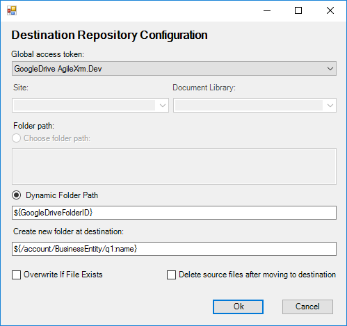
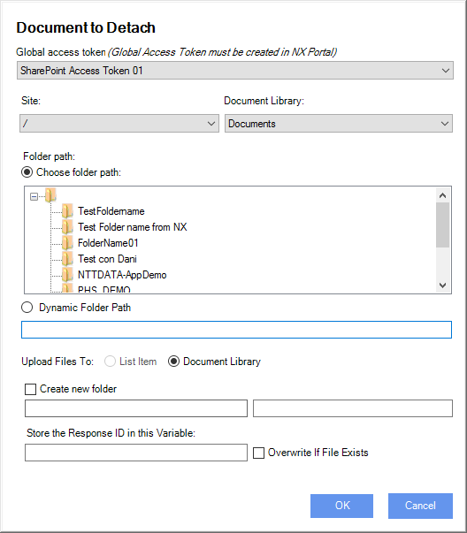

__[Home](/) --> [Reference](/ref) -->  [Parent Shape](javascript:history.back()) --> Destination__

### Destination property 

Defines the destination for the document transfer operation file or files.

First of all it need to choose the storage type for the document transfer operation, using the editor window.

Only items with related Global Access Token will be available to choose. 
To enable a storage type create an AgilePoint Global Access Token for it.

Once we choose the storage type, we need to choose the file (or files) path to tranfer.

When storage type is sharepoint we should set also The `Site` and `Document Library` fields.

**Global Access Token:** The AgilePoint global access token to access the source system. 

**Site:** (only for SharePoint storage) The SharePoint site where destination files are stored. Can be a static value or AgilePoint variable. This field is disabled from non SharePoint document repositories. 

**Document library:** (only for SharePoint storage) The SharePoint document library where destination documents are stored. Can be a static value or AgilePoint variable. This field is disabled from non SharePoint document repositories.

**Choose folder path:** The folder path where documents will be stored.  

**Dynamic folder path:** Same as *Choose folder path* using an AgilePoint variable.
This value depends on the storage type. For example, when document is stored in SharePoint server, this
field must contains the folder name, but when document source is Google Drive
this field must contain the folderID of GoogleDrive.

> **NOTE**: For systems that need a folderID, as GoogleDrive, the best practice is store the value in AgilePoint shared variable.

**Create new folder:** Indicates if new folder must be created in destination system. Can be a static value or AgilePoint variable.

**Store ResponseID in this variable:** Set the name of the process variable that will hold the ID of the document that is going to be created. 
The process variable can then be used elsewhere in the process.

**Overwrite if exists**: Indicates if the destination file should be overwrite
if exists.

> **NOTE**: The Process Server (AgilePoint Server) Application Pool Identity
should have Read permission on the file(s)

## Disclaimer of warranty

[Disclaimer of warranty](../../guides/common/DisclaimerOfWarranty.md)