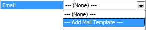

__[Home](/) --> [Reference](/ref) -->  [Parent Shape](javascript:history.back()) --> Email__

### Email property 

The name of an Email Template that should be used to generate an automatic email
notification when this AgileShape is entered at runtime.

To add new Email Template select Add Mail Template:

If left blank, the Shape is completed and no email is sent.

See **[Defining an Email Template](DefiningAnEmailTemplate.md)**
