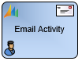
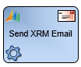
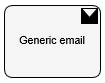
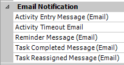

__[Home](/) --> [Reference](/ref) --> [Back](javascript:history.back()) --> Email Shape Comparison__

# Email Shapes Comparison Table

| **Email Shape Type**                         | **Sent by**      | **Create CRM Email Activity Record** | **Manual Send** | **Automatic Send** | **Email Template Type** |
|----------------------------------------------|------------------|--------------------------------------|-----------------|--------------------|-------------------------|
|  | Dynamics 365/CRM | YES                                  | YES             | YES                | AgilePoint              |
|               | Dynamics 365/CRM | YES                                  | NO              | YES                | Dynamics 365/CRM        |
|           | AgilePoint       | NO                                   | NO              | YES                | AgilePoint              |
| | AgilePoint       | NO                                   | NO              | YES                | AgilePoint              |

## Disclaimer of warranty

[Disclaimer of warranty](../../guides/common/DisclaimerOfWarranty.md)