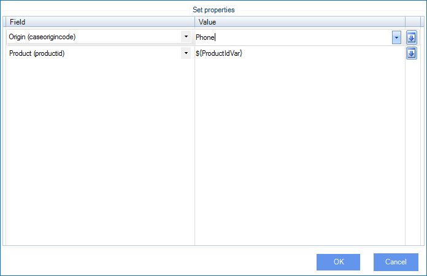

__[Home](/) --> [Reference](/ref) -->  [Parent Shape](javascript:history.back()) --> Entity Specification__

### Entity Specification property 

This is for updating the values of different attributes in the entity.
Click the ellipsis button to open the configuration window:

| **Field Name / Button** | **Definition**                                                                                              |
|-------------------------|-------------------------------------------------------------------------------------------------------------|
| **Field**               | Select the desired attribute to update from the list of all the attributes for the entity                   |
| **Value**               | The Value to set for the attribute. It can be static or dynamic. For dynamic value type **\${** to open the [Schema Selector](SchemaSelector.md) |
| **Down-Arrow button**   | Add a new row or Remove an existing row from the grid                                                       |

