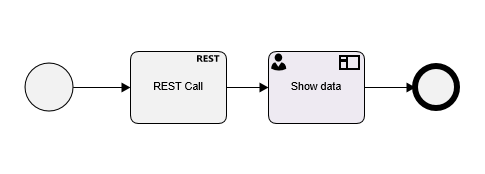
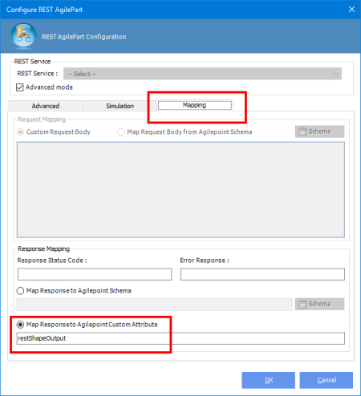
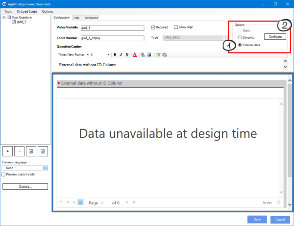
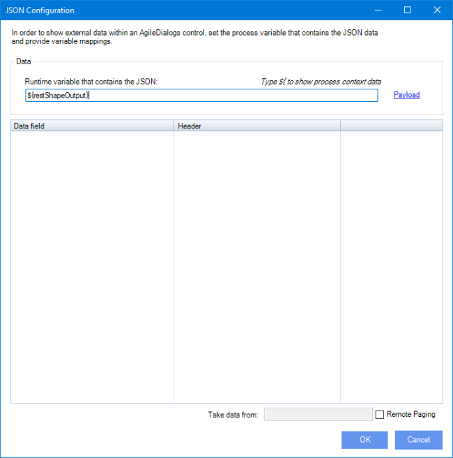
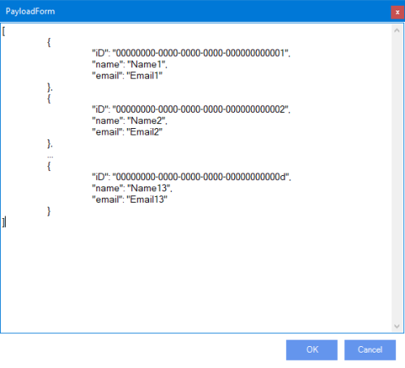
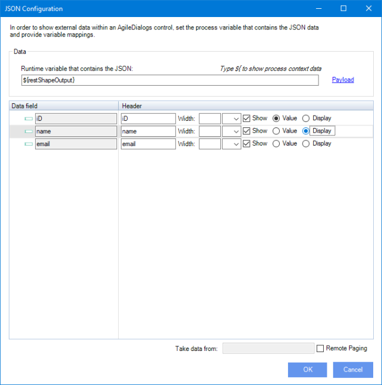
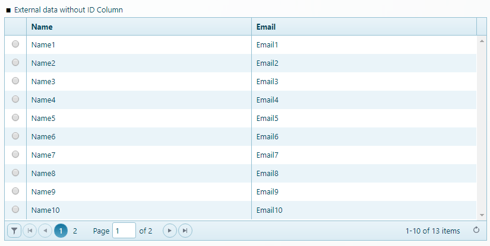
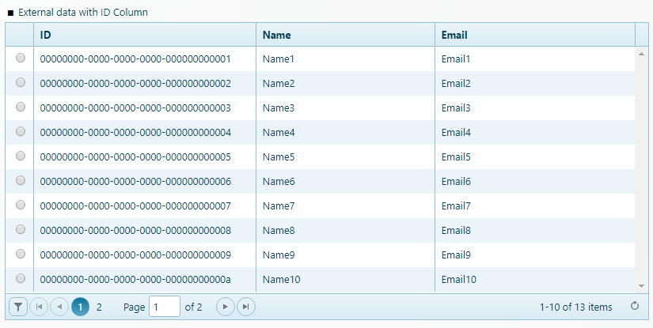

__[Home](/) --> [Reference](/ref) -->  [Parent Shape](javascript:history.back()) --> External data__

### External data

Some AgileDialogs controls as [XRM Grid](../../guides/common/XRMGrid.md) and [XRM Lookup](../../guides/common/XRMLookup.md) can show data from external systems.

In order to show external data is needed to perform these steps :
 
- Store the **JSON** data that we want to show within a process context variable. This step usually is performed by [**REST activity**](../REST.md) execution and store the response in context variable, 
but always we can use any other way to get this **JSON** value (like a SharePoint file that contains it)
- Configure the control to JSON data and bind it to previous context variable.
> **Note**: External data must be in **JSON** valid format.  Valid formats are shown below in this document.

### Sample

Here we will show an example of how to use external data in an AgileDialogs process. 

First of all we need to build an AgileDialogs process with a [**REST activity**](../REST.md) - used to get the external data - and a [**Page activity**](../../guides/common/PageFormShape.md) - used to show the data in [XRM Grid](../../guides/common/XRMGrid.md) control -.



It is needed to configure [**REST activity**](../REST.md) to store the result of its execution in a process context variable. This action is done from the mapping section, choosing the 'Response map to Agilepoint custom attribute' option and typing the process context variable to store the result within.
For this sample the variable name is *"restShapeOutput"*.



> **Note**: Can use this link to get the REST activity configuration page.[REST activity configuration](../REST.md)

> **Note**: For this sample, JSON data returned by REST activity has JSON Array format like this (we will need this value later):
```json
[
	{
		"iD": "00000000-0000-0000-0000-000000000001",
		"name": "Name1",
		"email": "Email1"
	},
	{
		"iD": "00000000-0000-0000-0000-000000000002",
		"name": "Name2",
		"email": "Email2"
	},
	...
	{
		"iD": "00000000-0000-0000-0000-00000000000d",
		"name": "Name13",
		"email": "Email13"
	}
]
```

Once done, we need to configure the [**Page activity**](../../guides/common/PageFormShape.md). Add a  [XRM Grid](../../guides/common/XRMGrid.md) control and configure it to extenal data:



> **Note**: Preview data is not available at designtime when  [XRM Grid](../../guides/common/XRMGrid.md)  control is configured to show external data.

Next, click `Configure` button to show configuration window, and under data section, set the runtime variable that contains the JSON value to show in control. Type here the same value that you puts previously in REST activity shape.



Click now in `Payload`link and put here the payload - Payload must be the JSON data structure returned by REST activity



Next, we need to set the ValueVariable and DisplayVariable fields. We can set here the column header, width and visibility too. 



Next within configuration window wills provide the following information:

- Runtime variable that contains the JSON. Type here the process context variable that was used to store the JSON data.
- Value Variable column: The property name of JSON object that we wan to store within ValueVariable. 
- Display variable: The property name of JSOn object that we wan to stre within DisplayVariable.

> **Note**: The values typed in the *Value Variable* and *Display Variable* mappings must exist in the JSON data structure that is going to display. 
For this reason the window shows at the bottom, an example of how the JSON content should be for a correct configuration.

- Show this column in results: By default, XRM Grid and XRM Lookup controls hides the column with entity ID. Check this options to change the behaviour and show it.



When *Show this column in results* is checked it will shown in results.


The rest of the values shown as columns in results correspond to each of the properties of the JSON data structure.

### Valid data formats

- JSON Array


```json
[
	{
		"iD": "00000000-0000-0000-0000-000000000001",
		"name": "Name1",
		"email": "Email1"
		[, "other propeties" : "values ..."]
	},
	{
		"iD": "00000000-0000-0000-0000-000000000002",
		"name": "Name2",
		"email": "Email2"
		[, "other propeties" : "values ..."]
	},
	...	
]
```

- JSON Object


```json
{
	"Enitites": [
		{
			"iD": "00000000-0000-0000-0000-000000000001",
			"name": "Name1",
			"email": "Email1"
			[, "other propeties" : "values ..."]
		},
		{
			"iD": "00000000-0000-0000-0000-000000000002",
			"name": "Name2",
			"email": "Email2"
			[, "other propeties" : "values ..."]
		},
		...
	]
}

```

## Disclaimer of warranty

[Disclaimer of warranty](../../guides/common/DisclaimerOfWarranty.md)
