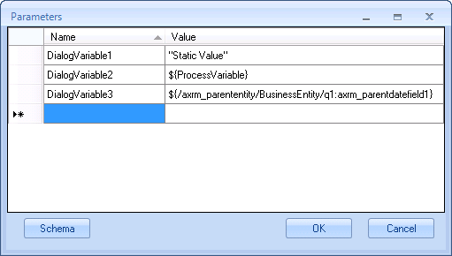

# In Parameters

**[Home](/) --> [Reference](/ref)  -->  [Parent Shape](javascript:history.back()) --> In Parameters**

---

Optional

This is for passing parameters to the dialog. These process variables will be
available in the dialog.

Click the ellipsis button to open the config window:

| **Field Name / Button** | **Definition** |
|-------------------------| ---------------|
| **Name** | This is the name of the Process Variable (aka Custom Attribute) to be created in the dialog |
| **Value** | This is the value that the variable is going to have. It can be a static value, a Process Variable or a value from the *Schema* |
| **Schema** | This opens the [Schema Selector](SchemaSelector.md) to select one for the *Value* column |

---

## Disclaimer of warranty

[Disclaimer of warranty](../../guides/common/DisclaimerOfWarranty.md)
