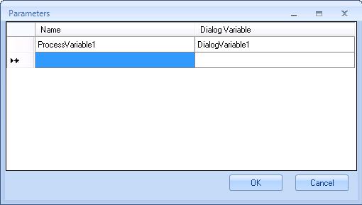

__[Home](/) --> [Reference](/ref)  -->  [Parent Shape](javascript:history.back()) --> Out Parameters__

# OutParameters property
Optional

This is for passing parameters from Dialogs to the calling Parent Process.

It is also possible to use the [**Update Parent Process**](../UpdateParentProcess.md) shape in the Dialog
itself to update Process Variables in the parent process, but this way it is
simpler to understand what the parent process expects back from the child dialog, 
especially when the calling process could be any or it is not known
when designing the Dialog.

Click the ellipsis button to open the config window:

| **Field Name / Button** | **Definition**                                                                                                                                                  |
|-------------------------|-----------------------------------------------------------------------------------------------------------------------------------------------------------------|
| **Name**                | This is the name of the Process Variable (aka Custom Attribute) to be updated in the current Process Do not use this format \$\{ProcessVariable1\}, use just the name |
| **Dialog Variable**     | This is the name of the Dialog Variable whose value we want to assign to our process variable Do not use this format \$\{DialogVariable1\}, use just the name         |
