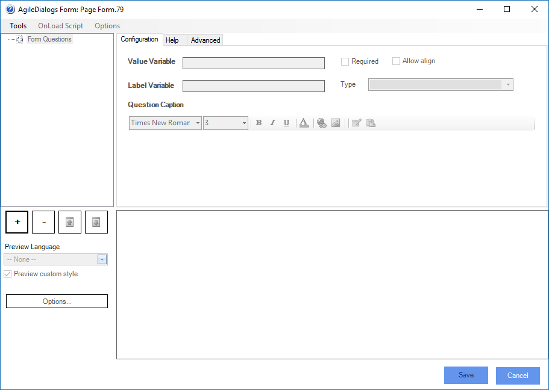

__[Home](/) --> [Reference](/ref)  -->  [Parent Shape](javascript:history.back()) --> Page Form__

### PageForm property

Optional

This property allows creating a single form for this activity.

Click the ellipsis button to configure the form in the [AgileDialogs form designer](../../guides/common/PageFormShape.md):

