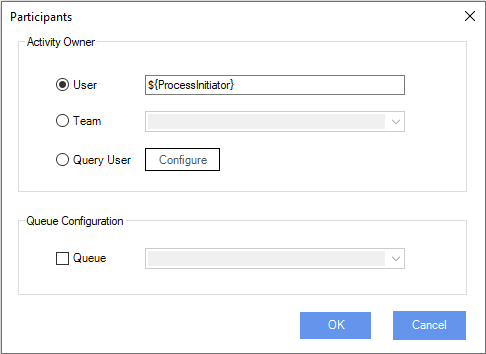

__[Home](/) --> [Reference](/ref)  -->  [Parent Shape](javascript:history.back()) --> Participants__

### Participants property 

This window allows to set the Activity owner and (optionally) assign the activity to a queue.

#### Activity Owner
Default Value: User (with **$\{ProcessInitiator}** variable as the given variable value).
It sets the participant or participants to be affected by this shape. 

1-	User. The participant can be configured by a process custom variable. 
The default value is **$\{ProcessInitiator}**, but we could change it for any other custom variable in our process. 

2-	Team. By selecting this, the participants will be determined by the selected CRM Team. 
It is also possible to type a team in the dropdown box.

3-	Query User. The owner user could be returned using a custom query to Dynamis 365/CDS

#### Queue Configuration
Optional

Queue. By selecting this, the activity will be assigned to a Dynamics 365/CDS queue. 
It is also possible to type a queue name in the dropdown box.

