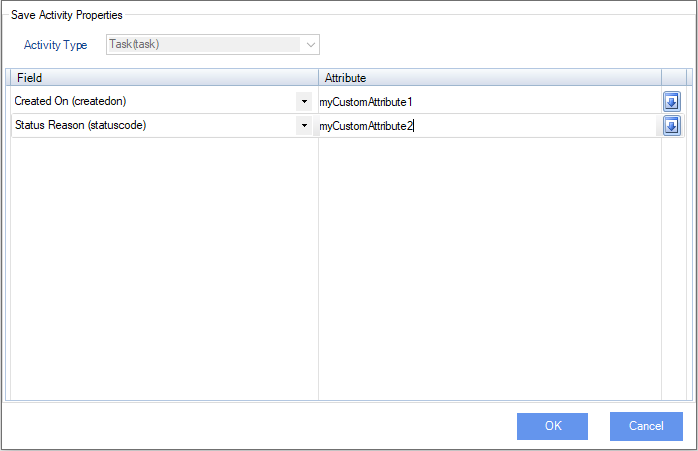

# SaveCRMActivityFieldsTo property

**[Home](/) --> [Reference](/ref) -->  [Parent Shape](javascript:history.back()) --> Save CRM Activity Fields To**

---

Click the ellipsis button to open the configuration dialog which can be used to
save any activity fields including custom fields:

| **Field Name / Button** | **Definition**                                                                 |
|-------------------------|--------------------------------------------------------------------------------|
| **Activity Type**       | Shows the activity selected in Activity Properties window (read-only) |
| **Field**               | Select the field for the selected Activity Type |
| **Value**               | Sets the name of the custom attribute where to store value of the Field whenever the activity is completed or cancelled|
| **Down Arrow**          | Add new Field-Value pair or Remove existing Field-Value pair |

---

## Disclaimer of warranty

[Disclaimer of warranty](../../guides/common/DisclaimerOfWarranty.md)
