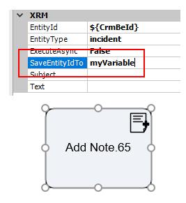

__[Home](/) --> [Reference](/ref) -->  [Parent Shape](javascript:history.back()) --> Save Entity ID To__

### SaveEntityIdTo property 

Sets the name of the custom variable that will hold the entity's ID that is going to be created, 
in the **AgileXRM** process context. The process variable can then be used elsewhere in the process.

For example, in an **Add Note** shape, when the process executes this shape, 
one could store the Note ID in a variable to use it somewhere else in the process.

## Disclaimer of warranty

[Disclaimer of warranty](../../guides/common/DisclaimerOfWarranty.md)