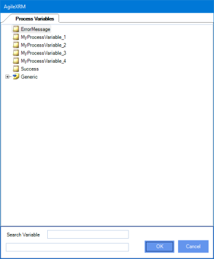
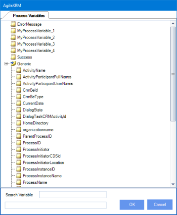
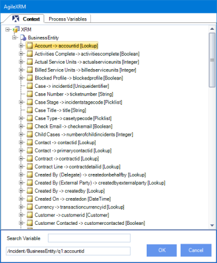
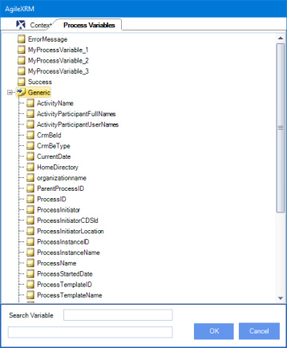

__[Home](/) --> [Reference](/ref) -->  [Parent Shape](javascript:history.back()) --> Schema Selector__

### Schema Selector

This window allows user get help to choose an existing process variable and use it in current configuration editor.

> **Note** : This window is usually automatically launchend by typing the `${`  key sequence

### Process without Main Entity and AgileDialogs Process

When the process template does not have `Main Entity` selected, Schema selector window contains an unique tab called Process Variables that contains the defined process variables.
Each node listed correspends with a process variable.

Each node listed under `Generic` node, corresponds with variables that are available for all process instances.

Get the [Schema Generic variables](../../guides/common/SchemaGenericVariables.md) list.

### Process with Main Entity

When the process template has `Main Entity` selected, Schema selector window contains an two tabs, the first called `Context` that contains the attributes of selected entity.

The second tab, called 'Process Variables' that contains the defined process variables.

 
## Disclaimer of warranty

[Disclaimer of warranty](../../guides/common/DisclaimerOfWarranty.md)