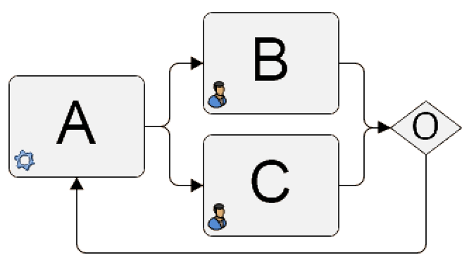

**[Home](/) --> [Reference](/ref) --> [Common Properties](/ref/common) --> Session Mode**

### SessionMode property 

Default value: **Single**

This property can be set to the following specific values:

-   **Single** - ONLY one session of this shape can be running,
    meaning that in a loop scenario, the engine would cancel a
    previous session automatically

-   **Multiple** - Multiple sessions can be
    running for the shape, and the process will wait for sessions to
    complete and not cancel any previous ones

## Disclaimer of warranty

[Disclaimer of warranty](../../guides/common/DisclaimerOfWarranty.md)