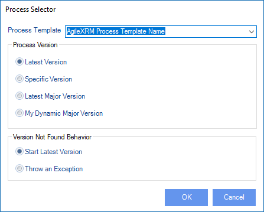

__[Home](/) --> [Reference](/ref)  -->  [Parent Shape](javascript:history.back()) --> SubProcess__

# SubProcess

This opens the Process Selector dialog for choosing which process and version to initiate.

This is the Process Selector dialog:

**Process Template**         This drop-down list will show all the processes that are already published in the Process Engine (AgilePoint Server). 
                             Select the name of the process that you want to initiate as a sub-process.                                                                                                                                                                                   

## Process Version
**Latest Version**           The process model version that has the status of *Released* is initiated.                                                                                                                                                                                                                                                                                                          

**Specific Version**          When this is chosen, all the available versions (including ones with the status of *Retired*) are listed in the drop-down list. 
                             Select the specific version of the model that you want to initiate as a sub-process.                                                                                                                                 

**Latest Major Version**      Version numbers are in the form Major.Minor (e.g. 4.06 or 3.50). 
                             When this option is selected, all the available Major versions of the selected Process Template are listed in the drop-down (including ones with the status of *Retired*). 
                             When the process arrives to this shape, it starts the highest Minor version of the chosen Major version. 

**My Dynamic Major Version** The calling parent process has a Major version. 
                             The version of the sub-process that is initiated is the highest Minor version of this Major version. 
                             This functionality is useful under 2 circumstances:

1.  You only have one environment (production) and it is not possible to test
    your new processes in another environment before publishing them to the
    production environment.

2.  Although you do have a test environment, you need to keep running these
    interdependent processes in the same version.

It is best to set the Major version for all these related processes to the same
value. When you want to deploy many new Templates, increment the Major version
for all of them, so that existing running processes do not initiate the new
Templates but the corresponding Template in their own Major version.

For example, you have 3 related processes:

*   Process A at version 1.04
*   Sub-Process B at version 1.34 - initiated from A
*   Sub-Process C at version 1.20 - initiated from B

Let's say you continue enhancing these processes and you then publish **B 2.0**
first and **C 2.0** on another day. If the sub-processes shapes were configured
with this option, new **A** process instances will continue initiating **B
1.34**, and **B** in turn would continue to initiate **C 1.20**. This is even
though there are new versions of **B** and **C** available in the Process
Engine. Once you publish **A 2.0**, then the new instances of **A** would
initiate the new versions of **B** and **C** (i.e. 2.0).

## Version Not Found Behavior

**Start Latest Version**     This is default behavior. If the *Process Option* above was *Specific Version, Latest Major Version* or *My Dynamic Major Version;* 
                             and at runtime, such a subprocess version is not available, then the Engine is instructed to run the latest version of the process irrespective of the *Process Option* (i.e. treat it as if the *Process Option* was *Latest Version*)                    

**Throw an Exception**       Rather than initiating the Latest Version, this option would cause the Engine to throw an exception at runtime when the desired version is not found. 
                             This way the System Administrator gets a chance to correct the error.                                                                                                                                                        

## Disclaimer of warranty

[Disclaimer of warranty](../../guides/common/DisclaimerOfWarranty.md)