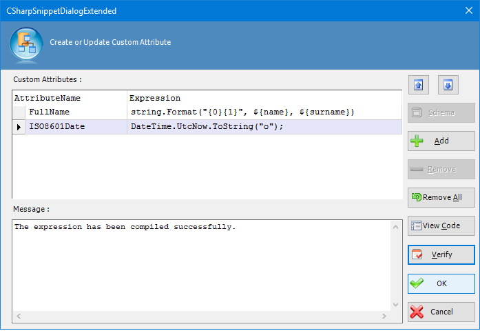
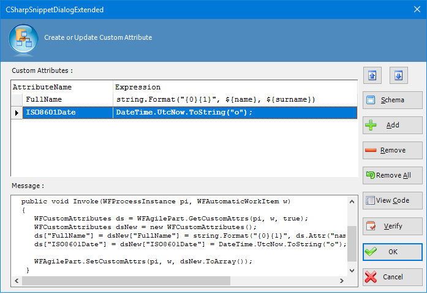

__[Home](/) --> [Reference](/ref) --> [Parent Shape](javascript:history.back()) --> Update Custom Attributes activity Configuration__

# Update Custom Attributes Configuration property

This property allows the process modeler to configure the code snippet(s) that will be invoked at runtime, as well as the custom process attribute(s) that the return value(s) of the snippet(s) will be stored in. Click the Ellipses button to open the configuration dialog. 

After clicking the Add button, entering an attribute name and a code snippet, and then clicking the View Code button, the dialog might look like this:

> Note: The Create or Update Custom Attributes configuration dialog is not intended as a complete replacement for Visual Studio.NET. It is recommend that you create a C# project that you can use as a "scratch pad" so that you have full access to Intellisense and other built-in tools while constructing your snippets. This will help in avoiding simple syntax mistakes and other errors.

## Disclaimer of warranty

[Disclaimer of warranty](../../guides/common/DisclaimerOfWarranty.md)