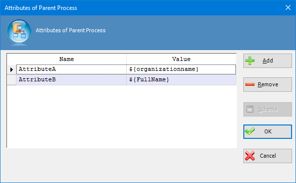

__[Home](/) --> [Reference](/ref) --> [Parent Shape](javascript:history.back()) --> Update Parent Process activity Configuration__

# Update Parent Process Attributes property

This property allows the process modeler to update the values of one or more custom process attributes in a separate process instance (see ParentProcessID). Click the Ellipses button to open the configuration dialog.

> **Note**: Can use *Schema* button to show process context window.

## Disclaimer of warranty

[Disclaimer of warranty](../../guides/common/DisclaimerOfWarranty.md)