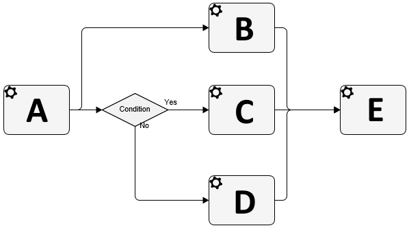

**[Home](/) --> [Reference](/ref) --> [Common Properties](/ref/common) --> Wait All Incoming**

### WaitAllIncoming property 

> **NOTE**: This property is ignored at runtime unless the AgileShape has multiple
> Incoming-Connectors.

When an AgileShape has multiple direct predecessors (e.g. below **E** has
multiple Incoming-Connectors leading directly from **B**, **C** and **D**), this
property determines how the predecessor AgileShapes must be exited (at runtime)
before this AgileShape can be entered (at runtime).

This property can be set to the following specific values:

-   **False** - This value indicates that the AgileShape (e.g. **E** in example
    above) will be entered as soon as any one of the AgileShape’s direct
    predecessors is exited (**B** or **C** or **D**, in example above).

    >   **NOTE**: This value is functionally equivalent to using the **Or**
    >   AgileShape (with **Exclusive** property set to **False**) between this
    >   AgileShape and its direct predecessors.

-   **True (Dynamic)** - This value indicates that the AgileShape (**E** in
    example above) will be entered only after all of the AgileShape’s
    *enter-able* direct predecessors (**B** and either **C** or **D** based on
    Condition) are exited. If any of the direct predecessors are *un-enter-able*
    because conditional logic in the process bypassed them (e.g. **D** if
    Condition was Yes) and therefore *un-exit-able*, then those predecessors are
    not required to be exited before this AgileShape (**E**) is entered.

    >   **NOTE**: This value is functionally equivalent to using the **And**
    >   AgileShape (with the **Dynamic** property set to **True**) between this
    >   AgileShape and its direct predecessors.

-   **True (Static)** - This value indicates that the AgileShape (**E** in
    example above) will be entered only after all of the AgileShape’s direct
    predecessors (**B**, **C** *and* **D**) are exited (at runtime). Use this
    only when all predecessors are *enter-able*.

    >   **NOTE**: If any of the direct predecessors are *un-enterable* (e.g. either
    >   **C** or **D**), then this AgileShape (**E**) will never be entered, and the
    >   process instance will be permanently delayed at this AgileShape.

    >   **NOTE**: This value is functionally equivalent to using the **And**
    >   AgileShape (with the **Dynamic** property set to **False**) between this
    >   AgileShape and its direct predecessors.

## Disclaimer of warranty

[Disclaimer of warranty](../../guides/common/DisclaimerOfWarranty.md)