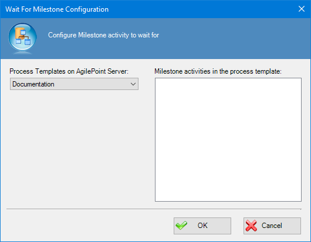
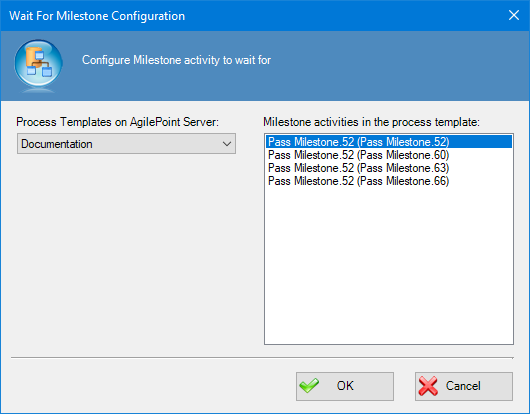

__[Home](/) --> [Reference](/ref) --> [Parent Shape](javascript:history.back()) --> Wait For Milestone activity Configuration__

# Wait For Milestone Configuration property

This property allows the Process Modeler to configure which milestone must be completed before continuing with the process execution.

Configure this by this way:

1. Choose the process template which contains the PassMilestone activity to wait for.

2. Choose the Milestone activity to wait.
3. 