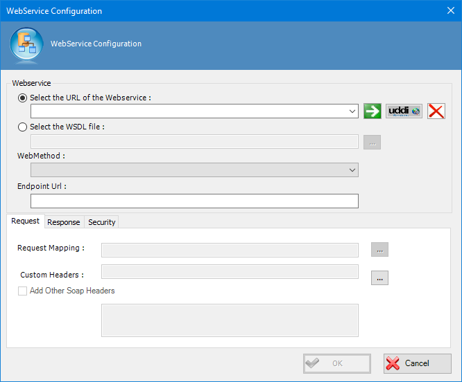
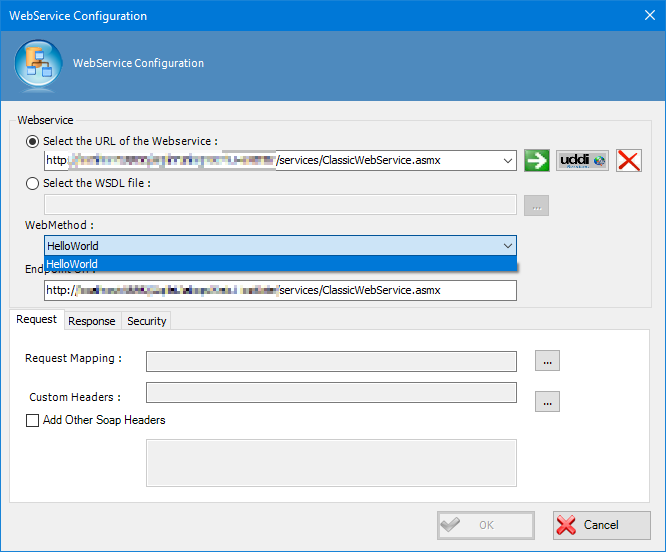
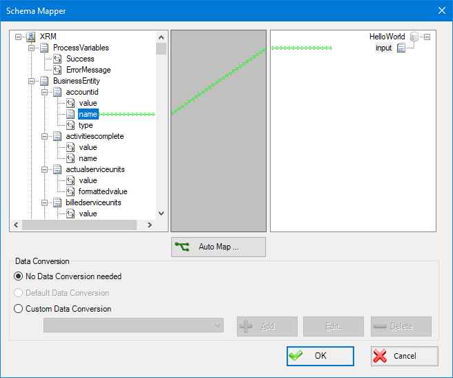
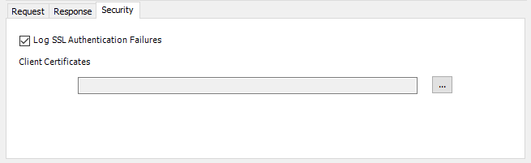
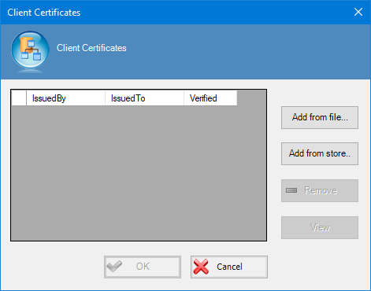
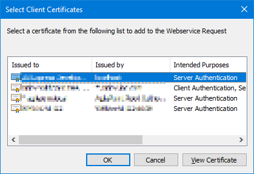

__[Home](/) --> [Reference](/ref) --> [Parent Shape](javascript:history.back()) --> Delay activity Configure__

# Web Service Enhancements Configure property

This property allows the process modeler to configure the Web Service Enhancements. Click the Ellipses button to open the dialog.

First of all it is needed to set the URL of the service (also can provide the WSDL file).

Once the URL of the WebService has been set, the *WebMethod* drop down list is filled with the web service available methods. Choose the method to be invoked.

Next we must configure the mappings for the request and the response of the service. At the bottom of the window, under *Request* option , we open the mapping for service request.

From the left side of window, drag the process context variables to the right side to map the process variable to the service request parameters. Repeat this step for each parameter of the service. 

> **Note**: Optionally we can set *Custom Headers* to be added to service request.

Then we must configure the mapping for the service response by the same way, but in this case the left side of the window contains the service response and the right side contains the process context variables.

Also we can store the full response in a Custom Attribute.

> **Note**: Not all nodes in AgileXRM process context can be written.

Optionally, under *Security* option, we can provide a SSL certificate to authenticate the user.

Click the ellipses button to open *Certificates* window:

Finally, we can choose a file with the certificate or select one from windows installed certificates store.

