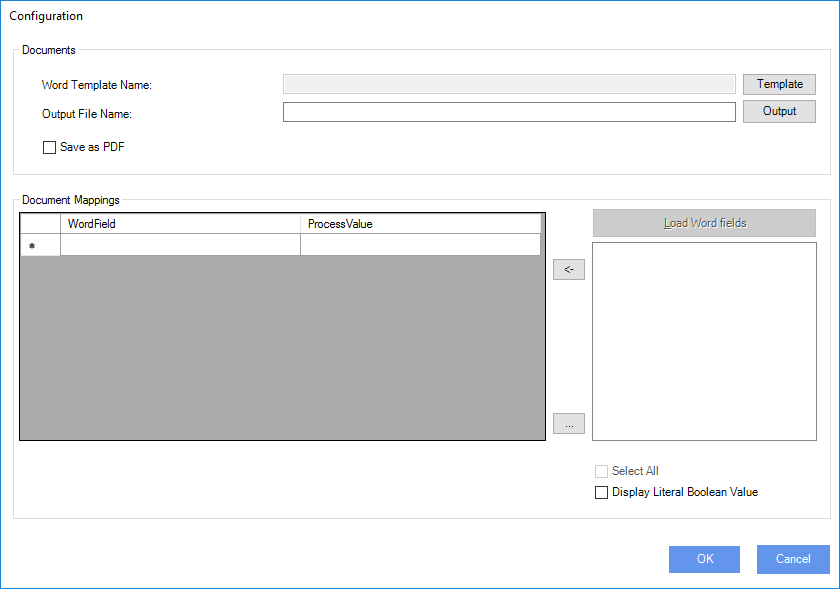
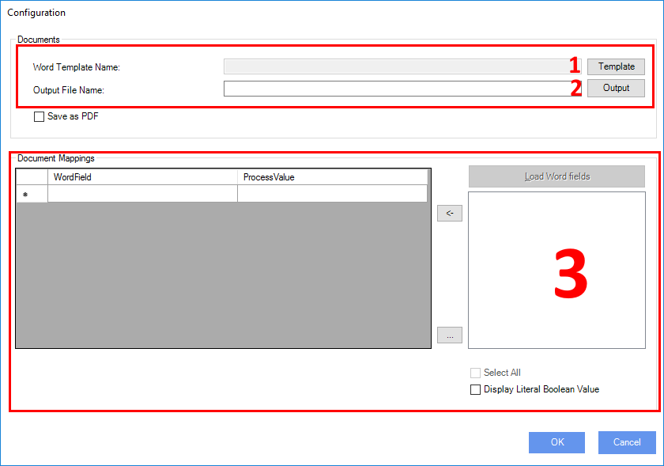
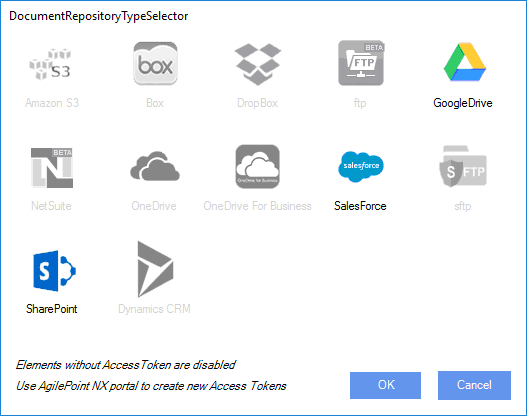
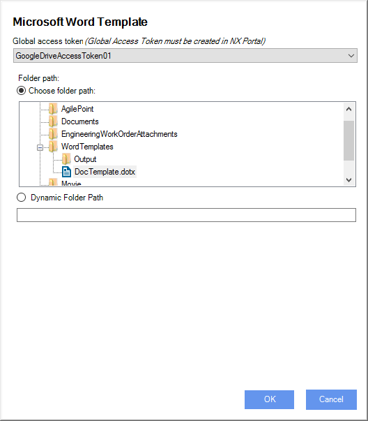
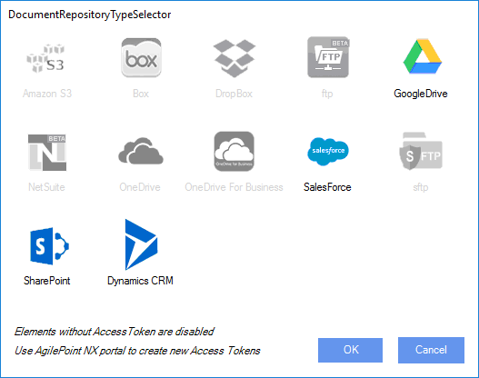
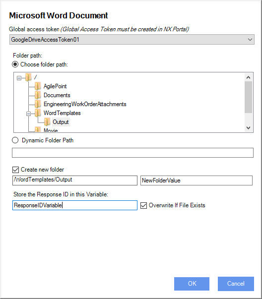
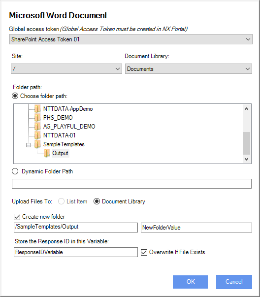
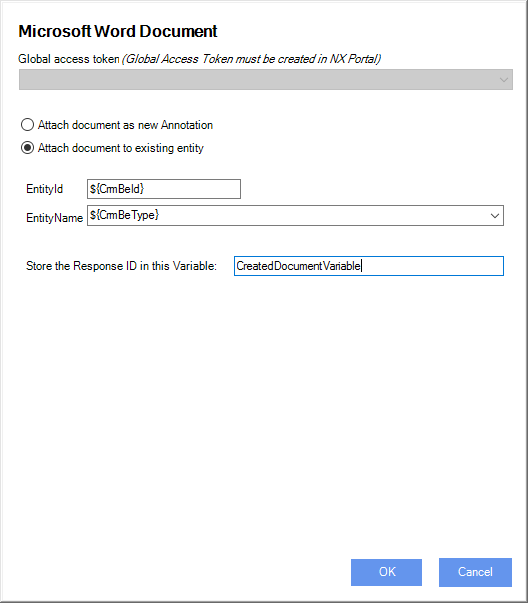
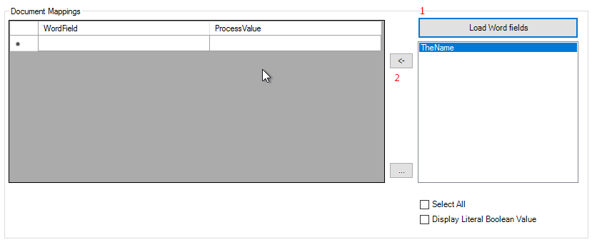
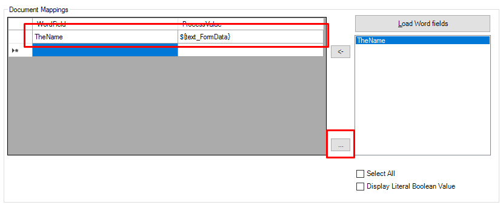

__[Home](/) --> [Reference](/ref)  -->  [Parent Shape](javascript:history.back()) --> Create word configuration__

### Create word Configuration property 

This property allows to configure the `Create Word Shape`.

To configure this shape proceed in this way:
* Choose a Word Template file
* Choose destination where file is going to be created
* Assign document mappings.

#### Word template file

This action allows select a Word Template for document that is going to be created.

First of all it need to choose the storage type where file is, using the editor window.

Only items with related Global Access Token will be available to choose. 
To enable a storage type create an AgilePoint Global Access Token for it.

Once we choose the storage type, we need to choose the Word template file.

**Global Access Token:** The AgilePoint global access token to access the source system.

**Choose folder path:** The folder path where template documents are stored. Choose a word template file or use *Dynamic folder path*.

**Dynamic folder path:** Same as *Choose folder path* using an AgilePoint variable.
This value depends on the repository type. 
For example, when document source is a SharePoint server, this
field must contains the folder name, but when document source is Google Drive
this field must contain the folderID of GoogleDrive.

> __NOTE__: For source systems that need a folderID, as GoogleDrive, the best practice
is store the value in an AgilePoint Shared Variable.

When storage type is sharepoint we should set also The `Site` and `Document Library` fields.

**Site:** (only for SharePoint storage) The SharePoint site where source documents are stored. Can be a static
value or AgilePoint variable. This field is disabled from non SharePoint
document repositories.

**Document library:** (only for SharePoint storage) The SharePoint document library where source documents are
stored. Can be a static value or AgilePoint variable. This field is disabled
from non SharePoint document repositpries.

#### Destination where file is going to be created

This action allows define where document is going to be created.

First of all it need to choose the storage type where file is, using the editor window.

> __Note:__ Dynamics CRM is available now

Once we choose the storage type, we need to choose where file is going to be created.

**Global Access Token:** The AgilePoint global access token to access the source
system.

**Choose folder path:** The folder path where template documents are stored. Choose a word template file or use *Dynamic folder path*.

**Dynamic folder path:** Same as *Choose folder path* using an AgilePoint variable.
This value depends on the repository type. 
For example, when document source is a SharePoint server, this
field must contains the folder name, but when document source is Google Drive
this field must contain the folderID of GoogleDrive.

> __NOTE__: For source systems that need a folderID, as GoogleDrive, the best practice
is store the value in an AgilePoint Shared Variable.

**Create new folder**: Indicates if new folder must be created in destination system. Can be a static value or AgilePoint variable.

**Store the ResponseID in this variable**: Set the name of the process variable that will hold the ResponseID of the document that is going to be created. The process variable can then be used elsewhere in the process.

**Overwrite if file exists**: Check to overwrite existing files.

**Ouput file name**: Indicates the name for document is going to be created. By default same as template.

**Save as PDF**: When this option is checked the output file will be generated using PDF format.

Also, when storage type is sharepoint we should set `Site` and `Document Library` fields.

**Site:** (only for SharePoint storage) The SharePoint site where source documents are stored. Can be a static
value or AgilePoint variable. This field is disabled from non SharePoint
document repositories.

**Document library:** (only for SharePoint storage) The SharePoint document library where source documents are
stored. Can be a static value or AgilePoint variable. This field is disabled
from non SharePoint document repositpries.

##### MS Dynamics destination

We can also create word documents in Dynamics CRM. 

In this case, it not needed an Global Access Token and integrated connection will be used.

**Attach document as new Annotation**: When this option is selected, the created word file will be attached 
to Dynamics CRM as new annotation without any entity relationship. In this case,  `Response ID` Field is mandatory.

**Attach document to existing entity**: When this option is selected, the created word file will be attached to Dynamics CRM 
as a new annotation related to Dynamics CRM specify entity by the `EntityID` and `EntityName`. In this case, `EntityID` and `EntityName` fields
 are mandatory.

**Store the ResponseID in this variable**: Set the name of the process variable that will hold the ResponseID of the document that is going to be created. The process variable can then be used elsewhere in the process.

#### Document mapping.

Once we have selected the Word Template, we can populate the template fields with AgilePoint process variables.

Configure document mappings by this way:

* Load Word Fields. This action gets the word template and fill the available fields in the list below.
* Move template fields to maping grid. 
* Set values for each fields. Assign process variables values to every template fields. 

