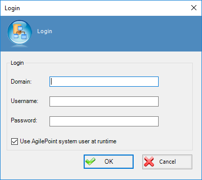

__[Home](/) --> [Reference](/ref) -->  [Parent Shape](javascript:history.back()) --> Credentials property__

### Credentials property

Defines the credentials that AgilePoint uses to invoke the current activity, both in designtime and runtime

- **Domain**: The domain user belongs.
- **Username**: The username.
- **Password:** The password.
- **Use AgilePoint system user at runtime:** Check this option when you wants to execute activity as AgilePoint system user. If this option is unchecked AgilePoint will executes the activity using previous credentials. 

