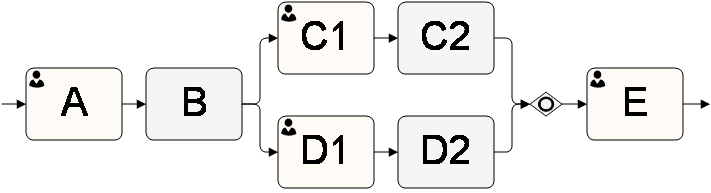

__[Home](/) --> [Reference](/ref) -->  [Parent Shape](javascript:history.back()) --> Exclusive__

### Exclusive property 

Default value: **False**

This property allows the process modeler to configure whether this AgileShape
will handle inputs exclusively or wait and process all inputs as they enter.

This property can be set to the following specific values:

- **True** - This value indicates that the AgileShape will handle incomplete
  activities from the parallel process flow exclusively based on the
  configuration defined using the Select Exclusive Predecessor Activities
  dialog. This dialog allows you to configure whether the activities in the
  parallel process flow will continue to process or be cancelled once one of
  the process flows enters this AgileShape. In this example process extract,
  the dialog can be configured to Cancel **D1** and **D2** activities once
  **C2** is completed. In any case, the **E** activity will be entered only
  **once**.  

- **False** - This value indicates that the AgileShape will continue to handle
  incoming activities (without the option of canceling the activities in the
  parallel process flow) regardless of the sequence upon which the process flow
  enters this AgileShape. In this example process extract, the OR AgileShape will
  be entered (and exited) once **C2** completes and again when **D2** completes.
  This means that the **E** activity will be entered **twice** in this example.

