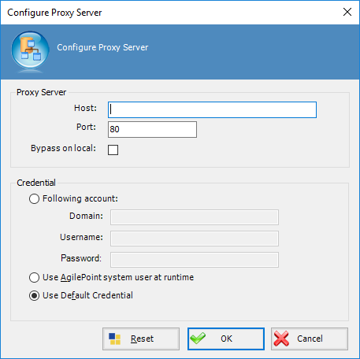

# Proxy property

**[Home](/) --> [Reference](/ref) -->  [Parent Shape](javascript:history.back()) --> Proxy property**

---

Allows to configura a Proxy conexion to execute activity.

Also we can provide a credentials to connect Proxy.

---

## Disclaimer of warranty

[Disclaimer of warranty](../../guides/common/DisclaimerOfWarranty.md)
