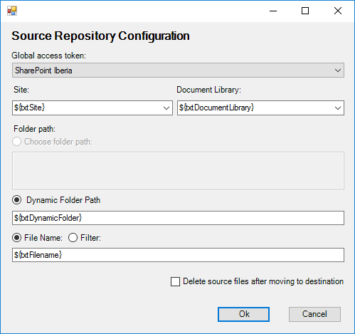
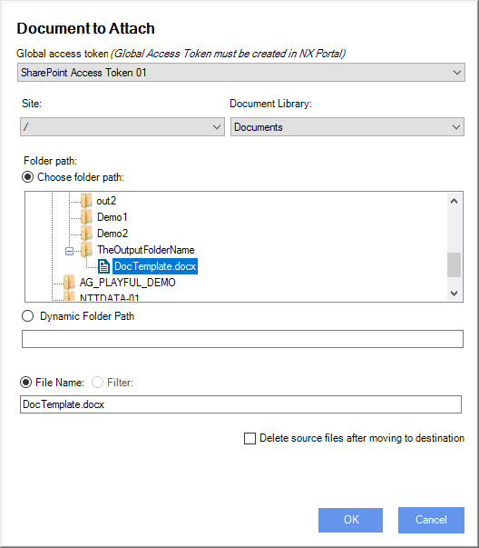

__[Home](/) --> [Reference](/ref)  -->  [Parent Shape](javascript:history.back()) --> Source__

### Source property 

This property allows select file source for document transfer operations.

First of all it need to choose the storage type for the document transfer operation, using the editor window.

Only items with related Global Access Token will be available to choose. 
To enable a storage type create an AgilePoint Global Access Token for it.

Once we choose the storage type, we need to choose the file (or files) path to tranfer.

When storage type is sharepoint we should set also The `Site` and `Document Library` fields.

**Global Access Token:** The AgilePoint global access token to access the source
system.

**Site:** (only for SharePoint storage) The SharePoint site where source documents are stored. Can be a static
value or AgilePoint variable. This field is disabled from non SharePoint
document repositories.

**Document library:** (only for SharePoint storage) The SharePoint document library where source documents are
stored. Can be a static value or AgilePoint variable. This field is disabled
from non SharePoint document repositpries.

**Choose folder path:** The folder path where source documents are stored. Choose a specific 
document to perform the transfer of single document, or choose a folder to transfer all files in folder 
(we can also apply filter) . 

**Dynamic folder path:** Same as *Choose folder path* using an AgilePoint variable.
This value depends on the repository type. 
For example, when document source is a SharePoint server, this
field must contains the folder name, but when document source is Google Drive
this field must contain the folderID of GoogleDrive.

> __NOTE__: For source systems that need a folderID, as GoogleDrive, the best practice
is store the value in an AgilePoint Shared Variable.

**File name:** The filename or filter for source files. 
When a folder is selected in `Choose folder path` field, we can apply a filter expression to get only the files thats satisfy filter.
Wildcards are allowed. For example, it can be “\*.pdf” to get all PDF files.

**Delete source files:** Indicates if the source files should be deleted after
tranferring the document.

> __NOTE__: The Process Server (AgilePoint Server) Application Pool Identity
should have Read permission on the file(s)
