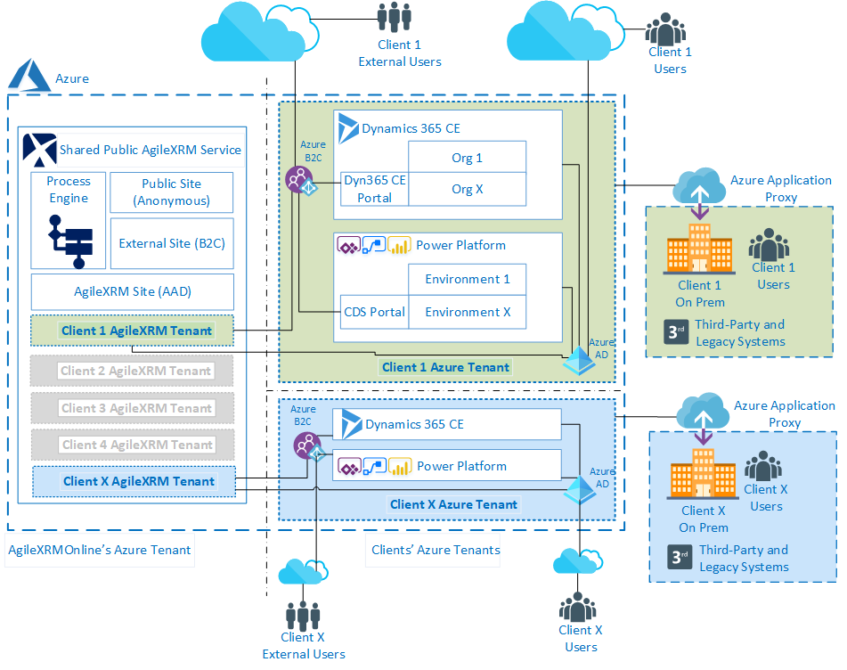
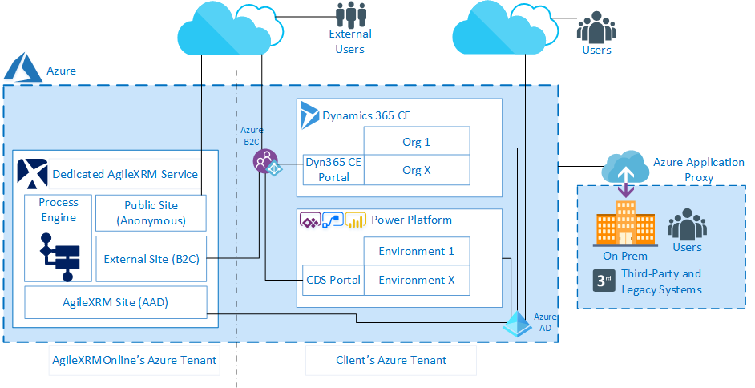
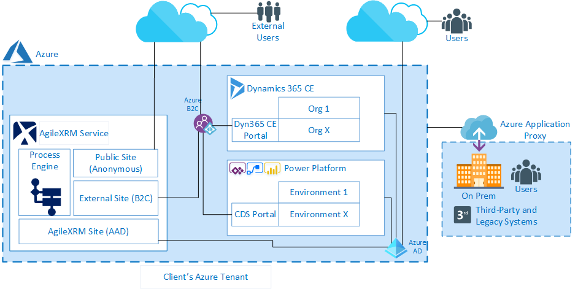

__[Home](/) --> AgileXRM System Requirements__

# AgileXRM System Requirements

## Introduction

This document describes the supported system requirements for installing
the components of the product suite. The following components are
included in the product suite:

-   Process Server (incl. Administration Portal)
-   Process Manager
-   Envision Process Modeler
-   Dynamics 365/CDS Integration
-   AgileDialogs
-   SharePoint Integration (Optional)
-   External Connector (Optional)

Requirements are kept in line with Dynamics 365 CE (CRM) System Requirements
as described here:

<https://docs.microsoft.com/en-us/dynamics365/customerengagement/on-premises/deploy/system-requirements-required-technologies>

AgileXRM supports **Microsoft Common Data Service (CDS) of Power Platform** as 
well as any Apps built on top of Dyn365/CDS like **Microsoft Project Online**.

AgileXRM currently *does not* support Dynamics 365 for Operations or Finance.

## Deployment Options

These are the different Deplyment Options that are supported:

|  #  | AgileXRM Installed in: &downarrow;         | Dynamics 356 CE / CDS Online | Dynamics 365 CE/CRM installed in Azure VM | Dynamics 365 CE/CRM installed in non-Azure VM | Dynamics 365 CE/CRM installed in client On-Premise |
|-----|--------------------------------------------|-----|-----|-----|-----|
|**A**| Public Cloud (Shared)                      |**Y**|  N  |  N  |  N  |
|**B**| Public Cloud (Dedicated)                   |**Y**|**Y**| (*) | (*) |
|**C**| Client Azure VMs (Managed by AgileXRM) |**Y**|**Y**| (*) | (*) |
|**D**| Client Azure VMs (Managed by client)   |**Y**|**Y**| (*) | (*) |
|**E**| Client Cloud non-Azure VMs                 | (*) | (*) |**Y**| (*) |
|**F**| Client On-Premises                         | (*) | (*) | (*) |**Y**|

>   **(*)** : **Not-Recommended** but consult for these combinations, as it 
>   maybe supported under certain circumstances.
 
## Deployment Options A and B

### AgileXRM in Public Cloud (A-Shared)

This is a tenant in a multi-tenant shared AgileXRM Online pool.
One AgileXRM tenant can support any number of Dynamics 365 CE Online organizations and/or 
Power Platform Common Data Service (CDS) Environments, as long as these are in the same Azure Region.
It is possible to connect to client's on-premise systems via Azure AD Application Proxy.

> **Figure 1**. Public Cloud (Shared)

### AgileXRM in Public Cloud (B-Dedicated)

This is a single tenant in a dedicated AgileXRM Online environment. Nothing is shared with any other client.
This can support any number of Dynamics 365 CE organizations (both installed or Online) and/or 
Power Platform Common Data Service (CDS) Environments, as long as these are in the same Azure Region.
It is possible to connect to client's on-premise systems via Azure AD Application Proxy.

> **Figure 2**. Public Cloud (Dedicated)

## Server Requirements for Deployment Options C, D, E and F

AgileXRM is very flexible in that it can be installed on one single server for smaller
deployments or distributed in a HA cluster for large deployments. The
components easily scale out. The information here applies to both physical
machines as well as virtual machines. VMs can also be in public Cloud like Azure
or other IaaS providers supported by Microsoft. For further information on
Virtual Machine support, please see Support for Virtualization Technologies further below.

### AgileXRM in Client Azure VM (Options C and D)

This is when AgileXRM is installed in client's Azure subscription. 
There is an option that AgileXRM manages the environment as a Managed Service or the client 
maintains the environment themselves. 
This can support any number of Dynamics 365 CE organizations and/or 
Power Platform Common Data Service (CDS) Environments, as long as these are in the same Azure Region. 
It is possible to connect to client's on-premise systems via Azure AD Application Proxy.

> **Figure 3**. AgileXRM in Client Azure VMs

### AgileXRM Server Requirements

This section provides detailed information about the specific optimal system
requirements for an AgileXRM  server, where all server components are
installed in one server:

| Feature            | Requirements               |
|--------------------|----------------------------|
| **vCPUs**          | 4                          |
| **Memory (RAM)**   | 8 GB RAM                   |
| **Hard Disk**      | 20 GB (RAID 1 or 5) SSD    |
| **Network**        | 1 Gb or higher             |

In Azure VM Size terminology:
- **PRO**: D8as v4 or higher 
- **Non-PRO**: B4MS or higher

#### System Requirements for Envision Process Modeler

This section provides detailed information about the specific system
requirements for the Envision component of.

| Feature               | Requirements                                            |
|-----------------------|---------------------------------------------------------|
| **Processor (CPU)**   | Follow recommendations for your Visio version           |
| **Memory (RAM)**      | 1 GB RAM                                                |
| **Hard Disk**         | 500 MB (plus an additional 150+ MB for Microsoft Visio) |

## Supported Microsoft Products

### Operating Systems

- Windows Server 2019
- Windows Server 2016 (ADFS 4.0 not supported)
- Windows Server 2012 R2

### Database

- SQL Server 2017 (Std, Ent, DC)
- SQL Server 2016 (Std, Ent, DC)
- SQL Server 2014 (Std, Ent, DC)
- SQL Server 2012 (Std, Ent, DC)
- SQL Server 2008 R2 (Std, Ent, DC)

>   **NOTE**: Support for Azure SQL is on the Roadmap. 
>   SSD disks are highly recommended for Production environments.

### Dynamics 365 Customer Engagement / Power Platform Common Data Service (CDS)

- Power Platform CDS 
- Dynamics 365 CE Online (8.2+, 9.0+)
- Dynamics 365 (CRM) 2016 (SP1 or higher)
- Dynamics CRM 2015 (Update 0.1 or higher)
- Dynamics CRM 2013 (SP1 or higher) 

> **NOTE**: CRM On-Premise Workgroup Edition is not supported.

### SharePoint

- SharePoint Online (also includes Teams Files, OneDrive for Business)
- SharePoint 2019 (Any Edition) 
- SharePoint 2016 (Any Edition) 
- SharePoint 2013 (Any Edition)

### Visio

- Microsoft Visio 2019 (Any Edition - x64 Only)
- Microsoft Visio 2016 (Any Edition - x64 Only)
- Microsoft Visio 2013 (Any Edition - x64 Only)

> **IMPORTANT**: The option *.NET Programmability Support* should be selected when installing Visio.

### .NET Framework

- .NET Framework 4.7.2

## Supported Browsers

- Microsoft Internet Explorer 10 or 11 (Not Compatibility View)
- Latest Chrome version 
- Latest Firefox version

## Support for Virtualization Technologies

AgileXRM is committed to fully supporting running on virtualization
technologies. AgileXRM supports both physical server machines as well as
virtual machines. AgileXRM recommends **Windows Server® Hyper-V™**,
however other Microsoft and non-Microsoft virtualization products are also
supported as discussed in the link below:

<http://www.windowsservercatalog.com/results.aspx?&bCatID=1521&cpID=0&avc=0>
