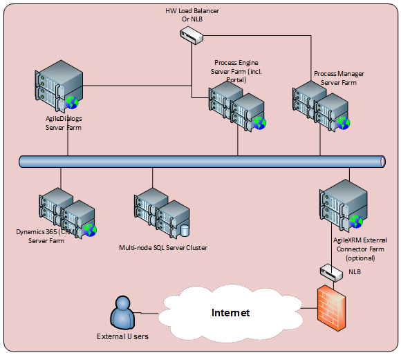

__[Home](/) --> AgileXRM System Requirements__

# AgileXRM System Requirementd

## Introduction

This document describes the supported system requirements for installing
each of the components of the product suite. The following components are
included in the product suite:

-   Process Server (incl. Administration Portal)

-   Process Manager

-   Envision Process Modeler

-   Dynamics 365 Integration

-   AgileDialogs

-   SharePoint Integration (Optional)

-   Developer SDK (Optional)

-   External Connector (Optional)

requirements are kept in line with Dynamics 365 CE (CRM) System Requirements
as described here:

<https://support.microsoft.com/en-us/help/2669061/compatibility-with-microsoft-dynamics-crm>

AgileXRM supports CDS for Apps.

currently does not support Dynamics 365 for Operations or Finance.

## Disclaimer of warranty

AgilePoint Inc. makes no representations or warranties, either express or
implied, by or with respect to anything in this document, and shall not be
liable for any implied warranties of merchantability or fitness for a
particular purpose or for any indirect, special or consequential damages.

**Copyright © 2018**, **AgilePoint Inc. All rights reserved.**

GOVERNMENT RIGHTS LEGEND: Use, duplication or disclosure by the U.S.
Government is subject to restrictions set forth in the applicable AgilePoint
Inc. license agreement and as provided in DFARS 227.7202-1(a) and
227.7202-3(a) (1995), DFARS 252.227-7013(c)(1)(ii) (Oct 1988), FAR 12.212(a)
(1995), FAR 52.227-19, or FAR 52.227-14, as applicable.

‘AgilePoint Inc.’ and all its products are trademarks of AgilePoint Inc..
References to other companies and their products use trademarks owned by the
respective companies and are for reference purposes only.

## Deployment Options

is very flexible in that it can be installed on one single server for smaller
deployments or distributed in a HA Farm set up for large deployments. The
components easily scale out. The information here applies to both physical
machines as well as virtual machines. VMs can also be in public Cloud like Azure
or other IaaS providers supported by Microsoft. For further information on
Virtual Machine support, please see Support for Virtualization Technologies on
page 16.

### Single Server Deployment

>   **NOTE**: These are minimum requirements. It is recommended to use the
>   Optimal System Requirements described in section 3.1.1

It is possible to install all components of in one single server including
Dynamics 365 (CRM), SQL Server and SharePoint (optional). It is always
possible to scale out to more servers at a later stage.

#### Non-Production Environments: Minimum System Requirements

For Development, Test, Demo or Evaluation environments the requirements are:

| Feature            | Requirements |
|--------------------------------|--------------------------------------------------|
| **Processor (CPU)**            | Dual-Core with clock speeds of 2.5 GHz or higher |
| **Memory (RAM)**               | 6 GB RAM                                         |
| **Available Hard Disk Space**  | 10 GB                                            |
| **Other Hardware or Devices**  | A network connection NIC 1 Gb or higher          |
| **Operating System (OS)**      | Microsoft Windows Server 2012 R2                 |
| **Locally Installed Software** | Microsoft IIS corresponding to OS version        |
| **Other Software**             | *One of the following DB servers:*  <ul> <li>Microsoft Windows Server 2016 (ADFS 4.0 not supported)</li> <li>Any of these browsers:</li><ul> <li>Microsoft Internet Explorer 10 or 11 (Not Compatibility View)</li> <li>Latest Chrome version</li> <li>Latest Firefox version</li></ul> <li>Microsoft .NET Framework 4.5.2</li> <li>Microsoft SQL Server 2008 R2 (Std, Ent, DC)</li> <li>Microsoft SQL Server 2012 (Std, Ent, DC)</li> <li>Microsoft SQL Server 2014 (Std, Ent, DC)</li> <li>Microsoft SQL Server 2016 (Std, Ent, DC)</li> <li>Dynamics CRM 2013 (SP1 or higher)</li> <li>Dynamics CRM 2015 (Update 0.1 or higher)</li> <li>Dynamics 365 (CRM) 2016 (SP1 or higher)</li> <li>Dynamics 365 CE Online (8.2+, 9.0+)</li> <li>CDS for Apps</li>  **NOTE**: On-Premise Workgroup Edition is not supported. **Optionally:** <li>   SharePoint 2013 (Any Edition)</li> <li>SharePoint 2016 (Any Edition)</li> </ul>|

#### Production Environments: Minimum System Requirements

It is recommended to have Dynamics 365 (CRM) and SQL Server on separate
machines, but having them all in the same machine is supported. The
requirements are very much dependent on intended usage, but minimum
requirements are:

| Feature            | Requirements |
|--------------------------------|--------------------------------------------------|
| **Processor (CPU)**            | Dual-Core with clock speeds of 2.5 GHz or higher |
| **Memory (RAM)**               | 8 GB RAM                                         |
| **Available Hard Disk Space**  | 10 GB                                            |
| **Other Hardware or Devices**  | A network connection NIC 1 Gb or higher          |
| **Operating System (OS)**      | Microsoft Windows Server 2012 R2                 |
| **Locally Installed Software** | Microsoft IIS corresponding to OS version        |
| **Other Software**             | *One of the following DB servers:* <ul> <li>Microsoft Windows Server 2016 (ADFS 4.0 not supported)</li> <li>Any of these browsers:</li> <ul><li>Microsoft Internet Explorer 10 or 11 (Not Compatibility View)</li> <li>Latest Chrome version</li> <li>Latest Firefox version</li></ul> <li>Microsoft .NET Framework 4.5.2</li> <li>Microsoft SQL Server 2008 R2 (Std, Ent, DC)</li> <li>Microsoft SQL Server 2012 (Std, Ent, DC)</li> <li>Microsoft SQL Server 2014 (Std, Ent, DC)</li> <li>Microsoft SQL Server 2016 (Std, Ent, DC)</li> <li>Dynamics CRM 2013 (SP1 or higher)</li> <li>Dynamics CRM 2015 (Update 0.1 or higher)</li> <li>Dynamics 365 (CRM) 2016 (SP1 or higher)</li> <li>Dynamics 365 CE Online (8.2+, 9.0+)</li> <li>CDS for Apps</li> **NOTE**: On-Premise Workgroup Edition is not supported. </ul>**Optionally:** <ul><li>SharePoint 2013 (Any Edition)</li> <li>SharePoint 2016 (Any Edition)</li> </ul>              |

### Multiple Server Deployments

Separating the components is recommended and the distribution depends on
intended usage. Here are some example scenarios:

#### Small Deployment Example

In this typical scenario for smaller-size deployments (\<200 users), all
server components (with the exception of External Connector) can be
installed on one server, with Dynamics 365 (CRM) and SQL Server being on
separate servers:

> **Figure 1**. Without External Connector

> **Figure 2**. With External Connector

Please see section 3.1.1 for optimal requirements.

#### Medium-size HA Example

For a minimum High Availability (HA) scenario for medium-size deployments
(100s of users), there would be 2 servers dedicated to (and if used, 2
servers for External Connector):

> **Figure 3**. With External Connector

Please see section Optimal System Requirements on page 10 for details.

#### Large HA Farm Example

**AgileXRM** can scale to tens of 1000s of users, if required. For very large-scale
deployments, a distributed HA Farm scenario may be set up where components
are distributed on multiple servers and load-balanced:

>   **Figure 4**. With External Connector

Components can be combined as well in one server. The choice of distributing
or combining components depends on the type of usage that users are going to
have of the system.

Please see section Optimal System Requirements on page 10 for details.

### Optimal System Requirements

#### System Requirements for Standalone Server

This section provides detailed information about the specific optimal system
requirements for a standalone server, where all server components are
installed in one server, but Dynamics 365 (CRM) and SQL Server are on
separate machines:

| Feature            | Requirements |
|--------------------------------|----------------------------------------------------------|
| **Processor (CPU)**            | 2 x Quad-Core CPU with clock speeds of 2.5 GHz or higher |
| **Memory (RAM)**               | 12 GB RAM                                                |
| **Available Hard Disk Space**  | 600 MB (RAID 1 or 5)                                     |
| **Other Hardware or Devices**  | A network connection NIC 1 Gb or higher                  |
| **Operating System (OS)**      | Microsoft Windows Server 2012 R2                         |
| **Locally Installed Software** | <ul> <li>Microsoft IIS corresponding to OS version</li> <li>Microsoft Windows Server 2016 (ADFS 4.0 not supported)</li> <li>Any of these browsers:</li> <ul> <li>Microsoft Internet Explorer 10 or 11 (Not Compatibility View)</li> <li>Latest Chrome version</li> <li>Latest Firefox version</li> <li>Microsoft .NET Framework 4.5.2</li> </ul> </ul>|

#### System Requirements for AgileXRM Process Server component

This section provides detailed information about the specific optimal system
requirements for the Process Server component of the . The recommended
requirements for this component can vary based on the intended usage of the
product. The System Administrator’s Portal is also installed on the same
machine.

| Feature            | Requirements |
|------------------------|----------------------------------------------------------|
| **Processor (CPU)**            | Dual-Core with clock speeds of 2.5 GHz or higher |
| **Memory (RAM)**               | 4 GB RAM                                         |
| **Available Hard Disk Space**  | 150 MB                                           |
| **Other Hardware or Devices**  | A network connection - NIC 1 Gb or higher        |
| **Operating System (OS)**      | Microsoft Windows Server 2012 R2                 |
| **Locally Installed Software** | <ul> <li>Microsoft IIS corresponding to OS version</li> <li>Microsoft Windows Server 2016 (ADFS 4.0 not supported)</li> <li>Any of these browsers:</li> <ul> <li>Microsoft Internet Explorer 10 or 11 (Not Compatibility View)</li> <li>Latest Chrome version</li> <li>Latest Firefox version</li> <li>Microsoft .NET Framework 4.5.2</li> </ul></ul>        |

#### System Requirements for AgileXRM Process Manager component

This section provides detailed information about the specific optimal system
requirements for the Process Manager component of .

| Feature            | Requirements |
|--------------------------------|--------------------------------------------------|
| **Processor (CPU)**            | Dual-Core with clock speeds of 2.5 GHz or higher |
| **Memory (RAM)**               | 2 GB RAM                                         |
| **Available Hard Disk Space**  | 150 MB                                           |
| **Other Hardware or Devices**  | A network connection NIC 1 Gb or higher          |
| **Operating System (OS)**      | Microsoft Windows Server 2012 R2                 |
| **Locally Installed Software** | <ul><li>Microsoft IIS corresponding to OS version</li><li>Microsoft IIS corresponding to OS version</li> <li>Microsoft Windows Server 2016 (ADFS 4.0 not supported)</li> <li>Any of these browsers:</li> <ul> <li>Microsoft Internet Explorer 10 or 11 (Not Compatibility View)</li> <li>Latest Chrome version</li> <li>Latest Firefox version</li> <li>Microsoft .NET Framework 4.5.2</li> </ul> </ul>   |

#### System Requirements for AgileDialogs component

This section provides detailed information about the specific optimal system
requirements for the AgileDialogs component of .

| Feature            | Requirements |
|------------------------|----------------------------------------------------------|
| **Processor (CPU)**            | Dual-Core with clock speeds of 2.5 GHz or higher |
| **Memory (RAM)**               | 2 GB RAM                                         |
| **Available Hard Disk Space**  | 150 MB                                           |
| **Other Hardware or Devices**  | A network connection NIC 1 Gb or higher          |
| **Operating System (OS)**      | Microsoft Windows Server 2012 R2          |
| **Locally Installed Software** | <ul><li>Microsoft IIS corresponding to OS version</li><li>Microsoft Windows Server 2016 (ADFS 4.0 not supported)</li> <li>Any of these browsers:</li> <ul><li>Microsoft Internet Explorer 10 or 11 (Not Compatibility View)</li> <li>Latest Chrome version</li> <li>Latest Firefox version</li> <li>Microsoft .NET Framework 4.5.2</li></ul></ul>     |

#### System Requirements for Envision Process Modeler

This section provides detailed information about the specific system
requirements for the Envision component of.

| Feature            | Requirements |
|--------------------------------|---------------------------------------------------------|
| **Processor (CPU)**            | Follow recommendations for your Visio version           |
| **Memory (RAM)**               | 1 GB RAM                                                |
| **Available Hard Disk Space**  | 400 MB (plus an additional 150+ MB for Microsoft Visio) |
| **Other Hardware or Devices**  | A network connection                                    |
| **Operating System (OS)**      | Any OS supported by Visio                               |
| **Locally Installed Software** | *One of the following*    <ul> <li>Microsoft Visio 2013 (Any Edition - x64 Only)</li> <li>Microsoft Visio 2016 (Any Edition - x64 Only)</li> **IMPORTANT**: The option **.NET Programmability Support** should be selected when installing Visio.</li> <li>Microsoft .NET Framework 4.5</li> <li>Windows Identity Foundation (<https://msdn.microsoft.com/en-us/security/aa570351.aspx?f=255&MSPPError=-2147217396>) <li>Microsoft Internet Explorer 10 or 11</li> </ul>                              |

#### System Requirements for Dynamics 365 (CRM) Integration component

This component can be installed anywhere (not necessarily on the Dynamics 365
(CRM) Servers themselves). It only unpacks the solution files (.zip) that need
to be imported into Dynamics 365 (CRM). The solutions do not actually consume
any noticeable server resources.

The Server(s) need to be in the same Active Directory Domain as the Dynamics 365
(CRM) Server(s), as they use Windows Integrated Authentication.

Users should either be added to the Dynamics 365 (CRM) User entity (systemuser)
- Internal Users, or to the Contact entity (contact) - External users.

| Feature            | Requirements |
|-------------|----------------------------------------------------------|
| **Available Hard Disk Space** | 15 MB                                  |
| **Operating System (OS)**     | Any OS supported by Dynamics 365 (CRM) |
| **Required Software**         | Dynamics CRM 2013 (SP1 or higher)<ul> <li>Dynamics CRM 2015 (Update 0.1 or higher)</li> <li>Dynamics 365 (CRM) 2016 (SP1 or higher)</li> <li>Dynamics 365 CE Online (8.2+, 9.0+)</li> <li>CDS for Apps</li> **NOTE**: Workgroup Edition is not supported. </ul>      |

#### System Requirements for AgileXRM Developer

This section provides detailed information about the specific optimal system
requirements for the Developer component of .

| Feature            | Requirements |
|----------------------------------------------------|----------------------------------------------------------|
| **Processor (CPU)**            | Follow recommendations for your Visual Studio version                        |
| **Memory (RAM)**               | 1 GB RAM                                                                     |
| **Available Hard Disk Space**  | 100 MB                                                                       |
| **Other Hardware or Devices**  | A network connection                                                         |
| **Operating System (OS)**      | Any OS supported by Visual Studio                                            |
| **Locally Installed Software** | AgileXRM Envision Process Modeler should be already installed on the machine. <ul><li>Microsoft .NET Framework 4.5.2</li><li>Microsoft Visual Studio 2010 or 2012 or 2013 or 2015 (Not Express Editions)</li></ul> |

#### System Requirements for AgileXRM SharePoint Integration component

This optional component consists of a set of SharePoint solutions used for
exposing Processes to users outside of Dynamics 365. These users could be
internal to the company or external to the company (For external users, an
External Connector License is required).

| Feature            | Requirements |
|---------------------------------------|----------------------------------------------------------|
| **Available Hard Disk Space** | 150 MB (in addition to the requirements of Microsoft SharePoint) |
| **Operating System (OS)**     | Any OS supported by SharePoint                                   |
| **Supported Software**        | *One of the following:*   <ul><li>Microsoft SharePoint Server 2013 (Any Edition)</li><li>Microsoft SharePoint Server 2016 (Any Edition)</li><li>Office 365 SharePoint Online</li></ul>                                       |

### Client-side End-User System Requirements

#### Process Participant client PC

| Feature      | Requirements     |
|--------------------------------|--------------------------------------------------------|
| **Operating System (OS)**      | Any OS supported by Dynamics 365 (CRM) web client      |
| **Locally Installed Software** | Any browser supported by Dynamics 365 (CRM) web client |

#### Full Users client PC

| Feature      | Requirements     |
|--------------------------------|--------------------------------------------------------|
| **Operating System (OS)**      | Any OS supported by Dynamics 365 (CRM) web client      |
| **Locally Installed Software** | Any browser supported by Dynamics 365 (CRM) web client |

### Support for Virtualization Technologies

AgilePoint is committed to fully supporting running on virtualization
technologies. AgilePoint supports both physical server machines as well as
virtual machines. AgilePoint recommends **Windows Server® Hyper-V™**,
however other Microsoft and non-Microsoft virtualization products are also
supported as discussed in the link below:

<http://www.windowsservercatalog.com/results.aspx?&bCatID=1521&cpID=0&avc=0>

AgilePoint recommends the following configurations to ensure optimal
performance of the in a virtual environment:

| Feature      | Requirements     |
|-----------------------------|----------------------------------------------------------------------------------------------------------------------------------------------------------------------------------------------------------------------------------------------------|
| **Host OS Architecture**    | x64                                                                                                                                                                                                                                                |
| **Host Machine Processors** | 8                                                                                                                                                                                                                                                  |
| **Memory**                  | 4 GB allocated to each virtual machine                                                                                                                                                                                                             |
| **Bandwidth**               | 1 Gb Network connection                                                                                                                                                                                                                            |
| **Virtual Memory**          | Memory allocation cannot always be guaranteed (i.e. if 4 GB is set for the virtual machine, it does not mean that the virtual machine will be using the entire 4 GB of memory at all times). The memory is shared amongst all the virtual machines |
| **AgileXRM Database**       | The Database role should preferably be on a physical machine                                                                                                                                                                                       |
